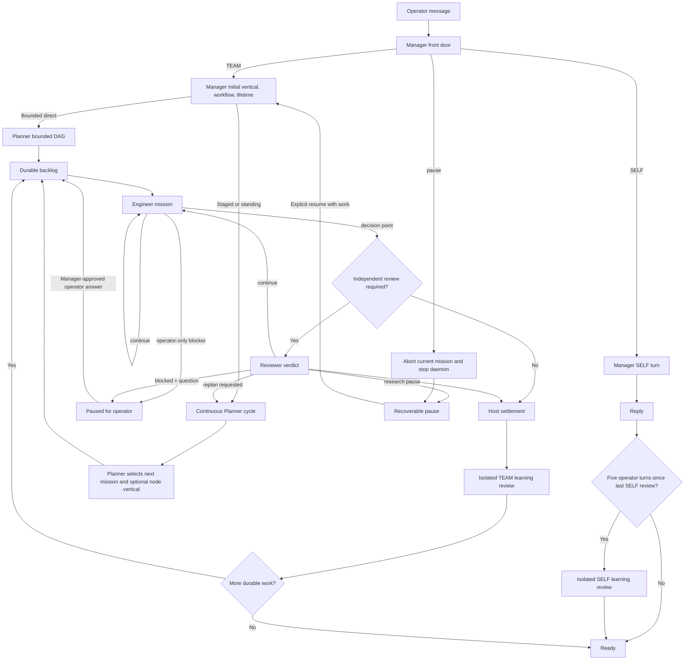

# Argus Features and Runtime Flows

This document describes implemented behavior, role transitions, learning
visibility, and the reliability scenarios used to verify them.

## 1. Entry routing

Every operator message enters through Manager's front door.

| Message outcome | Route | Execution |
| --- | --- | --- |
| Conversation or answer from current text | SELF reply | One Manager response |
| Read-only project/status inspection or simple single-role operation | SELF inspect | Manager uses project tools directly |
| File/artifact change, engineering, experiment, background work, or independent review | TEAM | Manager → Planner → Engineer → optional Reviewer |
| Explicit pause/abort/authorization | Control | Host changes durable runtime state |
| New task while a TEAM mission is active | TEAM queue | Current mission continues; new work is durable and serial |

Follow-up SELF turns use the persistent Manager session. A stateless fast reply
is allowed only when no conversation history or learned SELF Skill is needed.

## 2. Four-role state machine



### Manager

Manager owns:

- SELF versus TEAM routing;
- pause, abort, steering, and authorization controls;
- initial campaign vertical selection or project-local vertical creation;
- direct versus staged workflow;
- bounded versus standing lifetime;
- a clean standalone `execution_task`, used directly as the shared prose
  mission brief.

Manager may investigate any relevant repository evidence needed to control
overall direction and risk. Its tool boundary is read-only; it does not
implement the task or replace Planner's concrete file-level plan.

Manager does not reclassify the original objective after every mission. A
matching front-door route is reused for the campaign; later mission-level
vertical choices belong to Planner.

Manager never treats transcript wrappers as the Engineer objective. A short
contextual request is reduced to its current operator message if a model copies
the wrapper instead of resolving it.

### Planner

Planner is read-only and delegates work.

For bounded work it produces a small dependency DAG. One coherent deliverable
normally stays in one node. For staged or standing work it chooses one
decision-sized next mission from current evidence and may assign an existing
vertical to that node. Omitting the node vertical inherits Manager's campaign
route. Planner owns the technical
repository grounding; Manager routing does not precompute call chains,
analogues, or test plans.

Manager, Planner, Engineer, and Reviewer record primary-flow decisions as
`ARGUS_ROLE_DECISION` events as soon as each decision is clear. The Host reads
the whole event stream; a final assistant message may be natural language or
absent. Legacy named-output parsing remains only for in-flight compatibility.

Planner outcomes are:

- `planned`: executable work was added;
- `completed`: the finite operator objective is complete;
- `research_incomplete`, `paused_no_breakthrough`, or
  `exhausted_current_methods`: recoverable research pauses;
- `paused_budget`, `provider_cooldown`, or `infra_blocked`: recoverable runtime
  pauses;
- `error`: planning failed and is surfaced.

### Engineer

Engineer owns implementation, commands, tests, evidence, and the requested
deliverable.

- `status=done`: the mission reached its decision point.
- `status=continue`: another Engineer round is required.
- `operator_question`: only an operator-owned decision blocks work.

Engineer does not create process artifacts merely to prove that work happened.
Named-output constraints apply to new outputs and never authorize deletion of
pre-existing files.

### Reviewer

Reviewer independently inspects the Engineer result when review is required.
The main Reviewer is read-only.

| Reviewer verdict | Transition |
| --- | --- |
| `done` | Settle mission successfully |
| `continue` | Return `next_action` to Engineer |
| `replan_requested` | Return to Planner |
| `blocked` with operator question | Persist `paused_operator` and wait |
| `research_incomplete` | Preserve evidence and pause recoverably |
| `paused_no_breakthrough` | Pause until a new route or evidence exists |
| `exhausted_current_methods` | Pause without pretending project completion |

New custom verticals require independent review before promotion. Ordinary
formal direct tasks may complete without a separate Reviewer call when the Host
contract does not require one.

## 3. Durable task and daemon behavior

- A project daemon runs at most one mission at a time.
- Later TEAM requests are persisted and ordered without interrupting the active
  mission.
- A recent identical request reuses the existing backlog item by directly
  comparing its existing objective; no content hash or extra idempotency field
  is stored.
- Different requests remain separate missions.
- Web restart does not lose backlog state or cause a recent request to execute
  twice.
- Separate project daemons have separate workspaces, backlogs, transcripts, and
  output files.
- An uncaught Argus orchestration exception opens a durable runtime-failure
  circuit keyed by exception type, Argus call site, and normalized runtime path.
  Pending work and Planner calls are held under that same loaded release instead
  of repeatedly spending Agent turns. A release/source/checkpoint-contract change
  or a reviewed canary closes the circuit.

Explicit pause stops the current mission and daemon while preserving the goal
and backlog. An explicit resume that runs commands or changes artifacts is TEAM
work; it is not executed inline as a SELF reply.

### Manager model boundary and required prewarm

These are runtime design invariants:

- Every ordinary free-text operator message, including a pure greeting, remains
  model-classified. Explicit slash commands, authoritative item-specific
  pending-question answers, duplicate-request replay, and the deterministic
  "choose a specific item" guard when several questions are pending retain their
  existing control paths. The Host must not add keyword, regex, or local
  canned-reply routing for otherwise ordinary prose to bypass the Manager model.
- Selecting an active project starts best-effort background prewarm from both
  Web and TUI. Prewarm initializes ACP processes without spending a model turn;
  the lean front door also initializes its logical session. Full SELF creates
  its logical session on the first prompt. The eventual message still receives
  a real model decision.
- The active Manager session has two intentionally distinct warm transports:
  the lean front-door classifier and the full SELF transport. The classifier
  uses the compact model/effort and no tools; full SELF uses the configured
  Manager model, effort, workspace, and tool policy.
- ACP scope is `manager:<session-id>` and must be propagated to both the default
  backend and any separate Manager-role backend. When ACP and the corresponding
  label are enabled, prewarm must target the same backend and exact client key
  later used by the message. Prewarm honors
  `ARGUS_SKILL_COPILOT_ACP` and `ARGUS_SKILL_COPILOT_ACP_LABELS`; a disabled or
  excluded path starts no unused ACP client. Two identical classifier processes
  for one session indicate a scope/prewarm bug.
- Prewarm is limited to an active project and must not rotate or close a live
  Manager state concurrently. It runs asynchronously: a message sent
  immediately after project selection may race it. Successful completed prewarm
  removes process startup cost; it does not promise to remove the first full
  SELF logical-session creation or the model/tool reasoning time of a complex
  answer.
- Operator-facing replies identify only as Argus Manager. They never expose the
  backing provider/model/CLI as the product identity and do not narrate Skill
  matching, tool selection, search plans, or intermediate checks unless the
  operator asks for that process.
- Prewarm logs and status surfaces must not contain prompts, operator messages,
  credentials, tokens, or tool payloads. If the Manager backend is unavailable,
  classification fails closed, queues no task, and points the operator to
  `argus doctor --deep`.

On the local Copilot ACP benchmark used for this contract, fixing scope reuse
reduced an eight-second-prewarmed `你好` turn from 8.146 seconds to 3.937 seconds
and reduced duplicate classifier processes from two to one. This measurement is
diagnostic evidence, not a universal latency promise.

### Durable long commands and supervisor dialogue

- On POSIX, a command expected to run for more than two minutes is submitted to
  `argus_skill.tools.subagent`; a provider-native background task or a
  session-owned background shell is never its durable owner.
- `direct` is the default mode for deterministic commands such as builds,
  evaluations, and test suites. It adds no Supervisor model calls.
- `supervised` is used only when an experiment needs semantic monitoring,
  early-stop judgment, or a persisted discussion with the Engineer.
- A successful handoff requires the submit JSON receipt to contain
  `state=submitted`, `task_id`, `run_id`, and `check_with`. `check_with` uses the
  active Argus Python executable and is directly executable in a later turn.
  CHECKPOINT.md records these fields only when another round must observe the
  run.
- A supervised concern moves the task to `state=discussing`. Status returns an
  `ACTION_REQUIRED` message, a durable discussion path, and an executable
  `reply_with` command. The Engineer reads the concern and replies through that
  command before relaunching. The only exception is an explicit
  `--override-discussion "<reason>"` break-glass submit, whose reason is recorded
  durably. Supervisor and Engineer turns are appended to the same durable
  transcript, with heartbeat and terminal resolution recorded.
- Native Windows launches a detached Argus-owned worker for durable `direct`
  and `supervised` subagents. The worker persists registry/log state outside the
  provider turn, records its PID, applies CPU admission, and uses identity-checked
  process-tree cleanup. POSIX retains its process-group implementation; WSL2 is
  optional rather than required for Windows durability.

## 4. Verticals and workflows

Argus includes built-in verticals for recurring software, research,
mathematical, literary, hardware, and optimization work.

When no existing capability fits:

1. Manager inspects the real operator workspace.
2. Manager creates a small reusable project-local vertical.
3. The vertical starts as `candidate`.
4. Engineer executes under it immediately.
5. Reviewer resolves the same vertical contract from session state.
6. Successful independent review promotes it to `formal`.
7. Later tasks and sessions using the same profile can select it directly.

`direct` is used for one coherent work package. `staged` is used only when the
outcome genuinely requires dependent phases or independent evidence tracks.
Missing scope, manifest, checkpoint, Wiki, or report files are not automatic
reasons to delay substantive work.

## 5. Learning, Wiki, and framework self-maintenance

Argus has four distinct evolution mechanisms. SELF and TEAM learning maintain
reusable Skills; the Wiki stores durable project facts; framework
self-maintenance repairs or adopts Argus runtime code. These names are not
interchangeable: a `manager.self_maintenance.*` event is not a SELF learning
review.

### SELF evolution

- Events: `self.learning.review.started`, `self.learning.review.completed`, and
  `self.learning.review.failed`.
- Trigger: after a successful SELF/chat reply when at least five operator turns
  have accumulated since the previous SELF review.
- Execution: an asynchronous post-answer review that never delays or changes the
  answer that triggered it.
- Input: at most the latest twelve transcript turns.
- Learns: stable terminology, interpretation rules, reply preferences, and
  reusable SELF answer/tool procedures.
- Excludes: one-off history, transient paths and process IDs, unresolved
  failures, secrets, and generic advice.
- Destination: at most one related Skill under profile `skills/self/`.
- First use: the next applicable turn in the same session.
- Reuse: later tasks and later sessions using the same profile.

### TEAM evolution

- Events: `team.learning.review.started`, `team.learning.review.completed`, and
  `team.learning.review.failed`.
- Trigger: after a TEAM mission settles.
- Execution: an isolated post-mission learning review after the canonical
  mission result is already final.
- Success rule: one canonical successful mission is verified evidence for a
  reusable project candidate.
- Failure rule: learn only from a verified root cause or a repeated failure
  mechanism.
- Input: canonical mission result plus bounded project Skill candidates.
- Excluded input: raw transcript, agent I/O, daemon logs, and usage logs.
- Destination: the matching profile role directory:
  `manager/`, `planner/`, `engineer/`, or `reviewer/`.
- First use: the next applicable mission.
- Reuse: later tasks and later sessions using the same profile.

### Project Wiki

- Events include `wiki.initialized`, `wiki.created`, and `wiki.updated`.
- Purpose: declarative project knowledge, not execution procedure.
- Contains: project architecture and contracts, support and limitation
  matrices, stable environment constraints, and scope-qualified measurements.
- Excludes: procedures and checklists (Skills), task history, handoffs,
  evaluator results, and transient runtime metadata.
- Root: `.autors/<semantic-project>/wiki/`, with `INDEX.md` and semantic pages
  under `pages/`.
- Bootstrap: when Wiki support and automatic initialization are enabled, the
  runtime creates the root before the first mission; an existing root is always
  discovered and reused.
- Use: roles read `INDEX.md` for progressive disclosure and edit the relevant
  page and index directly during reviewed work.
- Scope: project workspace. Wiki facts do not silently become profile Skills.

### Framework self-maintenance

- Event family: `manager.self_maintenance.*`, deliberately separate from
  `self.learning.review.*`.
- Trigger: observed supervisor/Planner/Wiki-hook failures may request an
  immediate audit; otherwise the daemon audits on a recovery interval (30
  minutes by default).
- Input: a bounded, deduplicated set of runtime observations plus upstream
  update availability.
- Decision: Manager chooses `no_action`, evidence-bound `repair`, or `adopt`.
- Execution: repairs run in a private framework worktree with explicit affected
  paths and an acceptance check. Upstream adoption also uses a private worktree.
- Safety: the change must pass independent review and canary validation before
  handoff/publication; the maintenance role does not push, merge, or publish.
- Source capability: worktree repair is advertised only when the loaded framework
  root is a clean Git checkout with a committed HEAD. A frozen Desktop `_internal`
  tree is never treated as source and never reaches worktree preparation; it
  reports `maintenance_mode=release_update` and waits for a verified release built
  from a separate source repository.
- Scope: Argus framework source and runtime release state. It does not learn user
  preferences and does not write SELF Skills or project Wiki pages.

### Cross-role visibility

`OWN` means the role may maintain that pool. `REFERENCE` means it may read and
apply it but must not edit it as its own knowledge.

| Reader | SELF Skills | Manager Skills | Planner Skills | Engineer Skills | Reviewer Skills |
| --- | --- | --- | --- | --- | --- |
| SELF | OWN | OWN | REFERENCE | OWN | REFERENCE |
| Manager | REFERENCE | OWN | REFERENCE | REFERENCE | REFERENCE |
| Planner | REFERENCE | — | OWN | REFERENCE | REFERENCE |
| Engineer | REFERENCE | — | — | OWN | REFERENCE |
| Reviewer | REFERENCE | — | — | REFERENCE | OWN |

Consequences:

- SELF-evolved terminology and user preferences are available as read-only
  reference knowledge to all four TEAM roles.
- TEAM-evolved Manager, Planner, Engineer, and Reviewer procedures are available
  to SELF according to the table above.
- Task instructions, current evidence, and role boundaries always override a
  Skill.
- Project Skills override vertical and profile Skills for the same operation.

### Cross-task and cross-session timing

| Learning source | Same task | Next task, same session | New session | Different machine/profile |
| --- | --- | --- | --- | --- |
| SELF review | Cannot change the reply that triggered it | Available | Available | Only if the profile is copied or synced |
| TEAM review | Cannot change the settled mission | Available | Available | Only if the profile is copied or synced |
| Wiki edit | Available to later turns after the edit | Available | Available when the same project workspace is reused | Only if the project workspace is copied or synced |
| Framework self-maintenance | Never mutates the active turn in place | Available only after reviewed canary adoption | Available through the adopted runtime revision | Available only when that runtime revision is installed |
| Custom vertical promotion | Applies after review | Available | Available | Only if learned vertical data is copied or synced |

SELF and TEAM Skills are profile-scoped, Wiki knowledge is project-scoped, and
framework self-maintenance is runtime-revision-scoped. None is silently
cloud-synchronized.

## 6. Restrained execution and token efficiency

Argus treats hashes, manifests, provenance files, repeated checks, and process
documents as work only when the operator or an external interface requires
them. They are not default evidence of correctness.

Implemented controls:

- Manager preserves the operator's requested action and does not replace it
  with cleanup, Wiki, manifest, provenance, checksum, or extra verification.
- Planner defaults a coherent bounded request to one DAG node and folds reading,
  implementation, and one decisive validation into that node.
- Direct workflow does not require stage bundles, scope files, frontier files,
  checkpoints, or reports before substantive work.
- Engineer is instructed to use one decisive validation per claim and not
  repeat an equivalent passing check.
- Reviewer reuses trustworthy Engineer evidence and is not asked to create
  evidence packets or process files.
- Attachment upload and message context do not compute or expose content hashes.
- Recent duplicate requests are detected by directly comparing the existing
  backlog objective; no request fingerprint, hash field, or extra idempotency
  record is created.

Token controls:

- The active project prewarms both the lean classifier and full SELF ACP
  transports without spending a model turn.
- A context-free first SELF reply may use the lean quick path, but still remains
  model-classified.
- Follow-up SELF turns and turns with learned Skills use the persistent
  Skill-aware Manager session so speed does not discard context.
- Deterministic long commands use durable `direct` mode and therefore do not pay
  periodic Supervisor model calls. `supervised` is reserved for semantic
  monitoring or discussion.
- Planner does not run a second planning pass for a preplanned backlog node.
- Reviewer receives the mission objective and necessary evidence rather than a
  full project transcript.
- TEAM learning receives only the canonical result and bounded candidate Skill
  excerpts. It is explicitly denied raw transcript, agent I/O, daemon log, and
  usage-log input.
- A no-learning mission can stop without opening project evidence or writing a
  Skill.

Measured in the custom-vertical reliability scenario, removing recursive
post-mission log inspection reduced TEAM learning input from about 190,000
tokens to about 1,800 tokens when no Skill was warranted. A real promotion used
about 8,600 input tokens and produced one concise profile Skill.

## 7. Instruction following and prompt isolation

Argus keeps model-visible authority ordered as:

```text
current operator instruction
→ Manager standalone execution task
→ current Planner mission
→ current evidence and Reviewer guidance
→ project/vertical/profile Skills
→ advisory memory
```

Prompt-isolation rules:

- Front-door classification sees only the current message; it does not choose
  the vertical or rewrite the execution plan. TEAM handoff
  separately receives at most four recent turns, capped at 300 characters each,
  so a long correction keeps necessary context without polluting route control.
- Manager must emit a standalone `execution_task`. The Host presents that prose
  to Planner as the authoritative mission brief instead of creating a second
  context file. If it copies bounded conversation markers, the Host rejects the
  handoff instead of authoring or guessing a replacement.
- Manager selects a vertical from the requested action. Quoted commit subjects,
  logs, filenames, and errors remain evidence and are never expanded into new
  implementation work.
- Follow-up SELF turns use the persistent Manager session instead of a
  stateless answer.
- Any available SELF or TEAM Skill upgrades SELF reply mode to the full
  Skill-aware path.
- The untouched default identity-card template is never injected into role
  prompts. Only an operator-edited identity is model-visible.
- Recent project journal entries are not injected into Engineer by default.
  Mission-specific context comes from the current backlog item and handoff.
- Operator pause/abort is classified as intentional control, not stored as a
  reusable failure lesson.
- A failure capsule does not repeat the same text as both Outcome and Lessons.
- Planner acceptance checks must be capable of failing; tautologies such as
  `or True` and `|| true` are forbidden.
- Current operator constraints are repeated only where role authority requires
  them: original request, current mission, and explicit acceptance/non-goals.
- Bounded TEAM context includes the most recent persisted TEAM objective, so a
  correction remains grounded after intervening SELF conversation or Web
  restart without expanding the transcript window.

The prompt A/B fixture verifies that an exact two-line file request preserves
the operator text in Manager handoff, contains no default identity, recent
mission history, prior failure block, or tautological check in Engineer prompt,
and creates no file other than the requested deliverable.

## 8. Attachments and Unicode

- Session-scoped uploads support text, Markdown, JSON, CSV, image, and PDF
  files.
- Unicode attachment names and Unicode deliverable names are preserved.
- Boundaries include count, size, MIME, regular-file, session ownership, and
  no-symlink checks.
- Attachment metadata contains the path, original name, MIME, and size. It does
  not compute or expose a content hash.

## 9. Reliability scenarios

The following ordinary-user scenarios are exercised through the real Web API,
Web UI, Manager model, and daemon:

| Scenario | Expected result |
| --- | --- |
| Several sequential SELF messages | Context remains ordered and coherent |
| Two Manager messages overlap | Per-session Manager lock preserves order |
| SELF question during TEAM mission | SELF replies; TEAM direction and daemon remain unchanged |
| Same TEAM request repeated | One backlog item and one execution |
| Different TEAM requests during active work | Durable serial queue; maximum one running mission |
| Web restart followed by client retry | Existing recent item is reused |
| Pause during a long command | Mission stops, daemon exits, no partial success claim |
| Explicit resume of paused write task | New TEAM mission completes the work |
| Simple read-only file task | SELF performs it without creating a TEAM |
| Two project daemons run concurrently | Outputs and state remain project-local |
| Cross-session attachment id | Rejected with HTTP 400 |
| Delete or change workdir while daemon runs | Rejected with HTTP 409 |
| CSV plus Unicode text attachments | Correct calculated Unicode deliverable, no extra user files |
| Empty message | Rejected with HTTP 400 |
| SELF Skill used by TEAM | Engineer opens the SELF Skill and applies the user rule |
| TEAM Skill used by SELF | SELF opens the role Skill and applies the verified procedure |
| Exact task after unrelated conversation | Standalone Manager handoff; no transcript wrapper |
| Long correction listing commit titles | Prior author-rewrite goal retained; quoted titles are not implemented |
| Formal domain plus Git metadata correction | `software` wins because the requested action is history maintenance |
| Legacy attachment metadata | Removed SHA/integrity fields are stripped during read |
| Greeting followed by first TEAM task, including after Web restart | Greeting does not claim a title; the substantive task names the session |
| Web or TUI activates a project | Lean classifier and full SELF ACP transports prewarm under the same `manager:<session-id>` scope |
| Manager uses an explicit role-specific runner binary | Prewarm and message reuse the same Manager ACP client; no duplicate classifier process |
| Pure greeting | Still model-classified; reply identifies as Argus Manager and does not expose provider identity |
| First full SELF inspection after completed prewarm | SELF process is initialized; the logical session and model/tool work may still add latency |
| Deterministic command longer than two minutes | Durable `direct` receipt returns promptly and the command survives the submitting turn |
| Supervised experiment raises a concern | Status exposes `reply_with`; Engineer reply and Supervisor response persist in one discussion transcript |
| Detached subagent requested on native Windows | Argus-owned worker returns a durable submitted receipt and survives the provider turn |
| Default identity template | Excluded from model prompts until the operator edits it |
| Operator pause | Not captured or replayed as a failure lesson |
| Planner acceptance check | No unconditional-success or tautological checks |
| Successful Pi turn with no `CHECKPOINT.md` | Mission remains successful; empty open-item metadata and a persistence warning only when needed |
| Same uncaught runtime exception under rephrased missions | One durable circuit opens; later Planner/Engineer dispatch waits for changed runtime facts |
| Frozen Desktop framework repair request | Reports release-update mode and never runs `git rev-parse` against `_internal` |

## 10. Project lifecycle

Project lifecycle states are:

```text
incubating → running → writing → done → archived
                 ↘ quarantined
```

Lifecycle state is distinct from an individual backlog item. A bounded item can
finish while the project remains active. A completed project can accept new
TEAM work through an explicit Manager dispatch; quarantined and archived
projects require explicit recovery.
