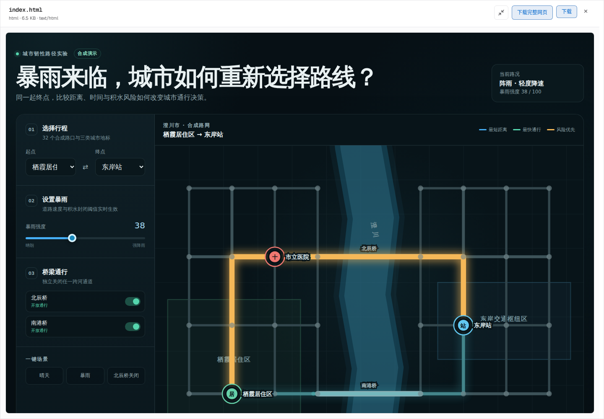
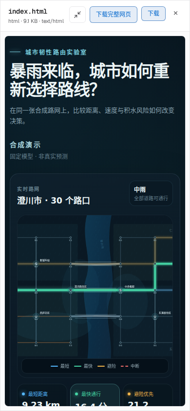

# Atlas 投资人演示：从目标到可交付产品

这份演示使用完整 Argus：在地图中输入目标，查看真实 Planner 任务依赖、执行与审查记录，再在 Delivery 中打开成果。网页演示和任务地图都在同一个 Argus 界面里。

## 推荐 Prompt

在一个新的空工作区会话中进入地图，将鼠标移到「交给 Argus」灵动岛上展开输入（手机点击），粘贴下面的完整内容。保持“自动”模式即可；本次彩排已通过自动分类进入软件任务。

```text
请在当前工作区真正完成一个可交付的交互产品：「暴雨来临，城市如何重新选择路线？」。这是面向投资人的中文演示，要同时体现工程实现、可复现实验、视觉设计与独立审查，不能只返回方案或静态示意图。

先由 Planner 根据真实输入依赖建立任务图：①城市路网与场景数据；②依赖路网的路径算法与验证；③依据数据接口可独立制作的交互界面；④依赖算法和界面的整合与实验；⑤最终浏览器验收与交付。每个节点要有明确产物和完成条件，独立工作允许并行，不要把所有内容塞进一个执行任务。

构造一个有河流、桥梁、医院、车站和居住区的合成城市路网，约 30 个路口，至少两座桥，数据可复现并明确标注「合成演示」。比较最短距离、最快通行和考虑积水风险的路线。暴雨强度改变道路速度与部分路段可通行性，路线与代价必须真实重新计算。模型假设写清楚；不要声称预测真实天气或真实交通。

交付一个离线可打开的 index.html：让人一眼看到城市地图和三种路线对比。视觉请做到成品级：克制的深色地图、清晰的区域和地标、蓝绿与琥珀色路线、流动的行驶光点、柔和的线路切换动画、精致的指标卡，留白和文字层级要舒服。核心交互是选择起终点、拖动暴雨滑块、关闭或恢复一座桥、切换三种策略；图上的路线、耗时、距离和风险要同步变化。手机上地图和控件也必须方便操作。默认打开就展示一条清晰路线，不要让首页空白，不要用装饰性按钮。

至少提供晴天、暴雨、桥梁关闭三个一键场景。使用固定种子生成不少于 30 组起终点与天气组合，验证路线连通性、代价计算、最优性和不可达情况，保留实际 results.csv。并交付一份简洁的 REPORT.md，包含 Markdown 表格、实测数字、关键发现、局限及复现命令。采用无需安装前端依赖的静态实现，资源随网页交付；不需要联网、账号、GPU或文献检索。

最终用真实 Chromium/Playwright 分别检查桌面和手机渲染，实际操作每个控件，检查控制台错误并修复问题；Reviewer 独立确认。最终交付 index.html、REPORT.md、results.csv 和可复现验证脚本，全部完成后停止。中间步骤用于构建与验证，最后再集中向我展示成品。
```

## 投资人会看到什么

1. 灵动岛展开输入，发送后收起并显示实时处理状态。任务受理后，一颗任务种子从岛中沿弧线飞出，落地时展开对应的真实任务卡。Planner 继续产生任务节点和依赖。
2. 数据任务完成后，算法和界面任务具备执行条件，再汇入整合与验收。运行中的任务和输入连线有动画；已完成状态依据真实记录变化。
3. 点开任务可深入查看环节，Agent 动态展示公开工作记录。说明中的粗体、列表、表格、代码、公式和交付链接会正常渲染。
4. 完成后打开 Delivery，查看网页、报告、数据与验证脚本。网页支持全屏和完整资源包下载。
5. 在成品里选择起终点、拖动暴雨强度、关闭桥梁、切换路线策略。地图路线与距离、耗时、风险一起重新计算；三个场景可一键切换。

最终城市与数值由真实实现和实验生成；以下是一次已实际运行并检查的交付示例。





## 现场展示顺序

- 先在同一个 Argus 中打开已完成的彩排记录，展示地图、验证证据和可操作成品。
- 新建一个独立空工作区会话，再输入上面的 Prompt，展示规划、任务生成和正在进行的工作。
- 打开任一任务和 Agent 动态，说明任务节点对应实际工作；返回 Delivery 操作暴雨、桥梁和策略。
- 最后查看 REPORT.md 的实测表格和 results.csv，并演示下载完整网页。

完整生成包含代码实现、实验、浏览器检查和独立审查。本轮六任务彩排从空目录到最终认证约 41.3 分钟，实际耗时会随模型与任务变化。现场先展示已完成成品，再输入 Prompt 展示实时任务图形成；不要将成品的交互速度描述为从零生成速度。示例城市数据明确标注为合成数据。

## 验证范围

已在 Chromium 与 WebKit 中分别检查桌面和手机流程，覆盖任务地图、Agent 动态、Delivery、Markdown 表格、SVG 城市地图、路线交互和完整网页下载；另已验证图生长、减少动态效果，以及下载的网页在零网络请求下打开并重算路线。测试覆盖本次演示的实际用户流程。
